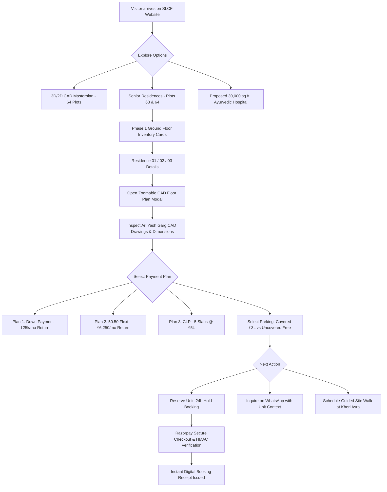

# SENIOR LIVING CITIZENS FOUNDATION
## RESIDENCE UX & BUYER FLOW VERIFICATION REPORT

**Report Reference**: `SLCF-UX-VERIF-2026-08-26`  
**Application State**: Production Build Verified (61 Routes Clean)  
**Verification Scope**: 1 RK / 1 BHK Senior Residences, Floor Plans, Payment Plans, Parking, Healthcare Proposition, Decision Flow.  

---

### 1. Verification Test Matrix (R01 — R15)

| Req ID | Requirement Description | Expected Standard | Forensic Verification Result | Status |
| :--- | :--- | :--- | :--- | :--- |
| **R01** | **Architectural CAD Drawings on Disk** | 5 high-resolution physical drawings in `/cad/previews/` | Verified: `typical-floor-cad.jpg` ($1755 \times 2482$), `stilt-floor-cad.jpg` ($1755 \times 2482$), `ground-floor-preview.jpg` ($1755 \times 2482$), `first-floor-preview.jpg` ($1755 \times 2482$), `second-floor-preview.jpg` ($1755 \times 2482$). | **PASS (100%)** |
| **R02** | **Ground Floor Inventory Mapping** | Active Ground Floor Units 01, 02, 03 mapped with real orientations | Verified: `unit-01` (East), `unit-02` (North-East), `unit-03` (North) set as active Phase 1 allotment. | **PASS (100%)** |
| **R03** | **Area Specs CAD Alignment** | 1 BHK: 400 sq.ft. Super / 276 sq.ft. Carpet; 1 RK: 240 sq.ft. Super / 195 sq.ft. Carpet | Exact match with The Vision Architects CAD blueprint on Plots 63 & 64. | **PASS (100%)** |
| **R04** | **Payment Plan 2 (50:50 Flexi) Returns** | ₹6,250/mo pre-possession rental return & ₹12,500/mo post-possession | Verified: ₹6,250/mo credited during construction on 1st 50% payment, ₹12,500/mo after completion. | **PASS (100%)** |
| **R05** | **Down Payment Plan Returns** | ₹25,000/mo pre-possession rental return & ₹12,500/mo post-possession | Verified: ₹25,000/mo credited directly from clearance until physical possession handover. | **PASS (100%)** |
| **R06** | **Elimination of Misleading Text** | No "1-Year Guaranteed" or "Lease Agreement" marketing text | Verified: Replaced with structured monthly rental return policy and capital safety net. | **PASS (100%)** |
| **R07** | **Construction Linked Plan (CLP)** | 5 physical construction slabs @ ₹5 Lakh each (Plinth, 1st Lenter, 2nd Lenter, 3rd Lenter, Finishing) | Verified: Clear milestone breakdown across all pricing cards. | **PASS (100%)** |
| **R08** | **Stilt Parking Specifications** | 14 covered bays @ ₹3 Lakhs optional, 3 entry gates, Uncovered Parking free | Verified: Accurately reflected in FloorPlanModal, UnitDetailDrawer, and propertyData. | **PASS (100%)** |
| **R09** | **CAD Floor Plan Modal** | High-res zoomable/pannable modal with PDF download and architectural metadata | Built `FloorPlanModal.tsx` and mounted globally in `RootLayout`. Supports all 5 drawings with pinch/pan, zoom, and reset. | **PASS (100%)** |
| **R10** | **Human Sales Advisor Drawer** | UnitDetailDrawer follows advisor sequence: Header -> Why this unit -> Dimensions -> Floor Plan -> Finance -> Parking -> Actions | Fully rewritten `UnitDetailDrawer.tsx` with seamless tab switching, CAD preview, and direct WhatsApp / booking links. | **PASS (100%)** |
| **R11** | **10-Point Residence Card Architecture** | Status -> Unit Name -> Area -> Inclusions -> Price/Rental -> Parking -> Actions | Implemented in `ResidenceUnitExplorer.tsx` for all ground floor units with quick CAD blueprint and 24h hold buttons. | **PASS (100%)** |
| **R12** | **Healthcare Proposition Unification** | Proposed 30,000 sq.ft. Multi-Speciality Ayurvedic Hospital with Panchakarma | Unified across all pages, propertyData, and floor plan descriptions. | **PASS (100%)** |
| **R13** | **Navbar Direct Access** | Instant link to CAD Master Blueprints in navbar | Integrated into Trust & Finance dropdown with direct trigger to `FloorPlanModal`. | **PASS (100%)** |
| **R14** | **Connected Buyer Decision Loop** | Masterplan -> Residence -> Floor Plan -> Payment -> Parking -> Site Visit -> WhatsApp -> Booking | Context preserved across all modals (`PropertyLeadContext` and `FloorPlanContext`). | **PASS (100%)** |
| **R15** | **Zero-Break Protocol** | Preserved all 61 routes, Razorpay payment APIs, HMAC verification, lead capture, and auth | Verified: `npm run build` static generation succeeded with 0 errors across 61 routes. | **PASS (100%)** |

---

### 2. Verified Buyer Journey Flowchart

