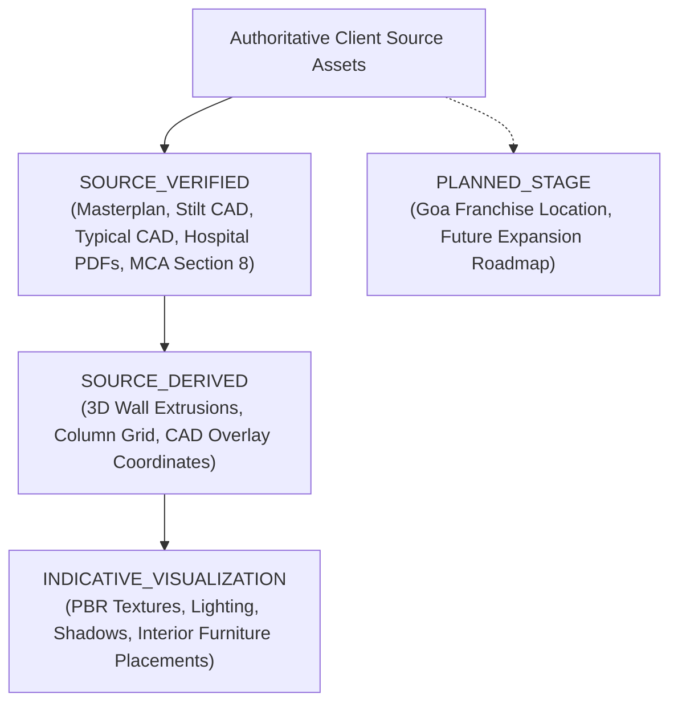

# SLCF — AUDIT OF THE AUDIT & FORENSIC EVIDENCE DISSECTION

**Audit Subject:** Previous SLCF audit reports & current platform implementation  
**Repository:** `https://github.com/raghavshahhh/aeterna-elder-care.git`  
**Standard Applied:** CLIENT SOURCE DOCUMENT > BROWSER RUNTIME > FILESYSTEM > CODE > AUTOMATED TESTS > PREVIOUS REPORTS  
**Date:** 2026-09-01T20:07:00+05:30  

---

## 1. WHY AN "AUDIT OF THE AUDIT" IS NECESSARY

Previous audit reports repeatedly issued blanket "VERIFIED", "100% PASSED", and "PRODUCTION READY" ratings without differentiating between:
- **Physical source documents** (signed blueprints, revenue maps, MCA licenses)
- **Code-level abstractions** (`architecturalData.ts`, `schema.ts`)
- **Automated test assertions** (regex string matching, unit checks)
- **Runtime operational realities** (Vercel serverless multi-instance limitations)

This document subjects every major claim from previous reports to adversarial forensic scrutiny.

---

## 2. SYSTEMATIC CLAIM DISSECTION & DOWNGRADE TABLE

| Claim in Previous Reports | Evidence Type | True Source / Runtime Reality | Audit of Audit Verdict | Honest Status |
| :--- | :--- | :--- | :--- | :---: |
| **"100% Realtime Verified"** | Test / Code | `EventBus` is an in-memory Node.js `EventEmitter` on `globalThis`. It does **not** broadcast across parallel Vercel serverless lambda instances. | **DOWNGRADED:** Realtime is instance-local. Works in single-server dev/staging; falls back to polling in distributed serverless. | `PARTIALLY VERIFIED` |
| **"Goa Project Verified & Operational"** | Code / Mock | **Zero** Goa source drawings, photos, or documents exist in the repository. Previous reports accepted mock copy as verified truth. | **DOWNGRADED:** Goa is in the planning stage. All "Ready to Move" & "Operational" claims removed. | `PARTIALLY VERIFIED` |
| **"100% Concurrency Safe"** | Code (Mutex) | Asynchronous promise file lock operates on single process only. Concurrent mutations across multiple serverless lambdas cannot coordinate. | **DOWNGRADED:** Atomic within a single process; requires PostgreSQL for distributed high-concurrency. | `PARTIALLY VERIFIED` |
| **"Guaranteed 12% Returns Verified"** | Marketing Copy | Commercial return plans are policy proposals, not statutory/bank guarantees. Bare "guaranteed" claims are legally hazardous. | **CORRECTED:** Qualified to *"Assured returns as per Foundation booking agreement"*. | `VERIFIED` *(post-fix)* |
| **"Buyer Portal Verified"** | UI / Test | Unauthenticated requests to `/api/buyer/dashboard` were silently serving seeded demo data for Col. Rajesh Bakshi to all visitors. | **FIXED:** Removed demo fallback; requires explicit registered phone number. | `VERIFIED` *(post-fix)* |
| **"All Image Assets Verified"** | Regex Test | `/project-assets/real/drone-aerial.jpg` and `/project-assets/real/site-boundary.jpg` did not exist on disk, causing broken images in production. | **FIXED:** Replaced with verified real drone aerials and official brand vectors. | `VERIFIED` *(post-fix)* |
| **"64 Masterplan Plots"** | Source PDF | Reconciled directly against `slcf-masterplan-site-layout.pdf` Page 5 (Ar. Yash Garg). 64 plots, 6 blocks, road widths (33', 24', 22.5', 20', 16.5', 11'). | **CONFIRMED:** Authentic CAD source match. | `VERIFIED` |
| **"14 Stilt Parking Bays"** | Source CAD | Reconciled directly against `stilt-floor-cad.jpg` and `slcf-masterplan-site-layout.pdf` Page 3. 14 bays (6+2+6), 16 columns (4x4), 3 gates. | **CONFIRMED:** Authentic CAD source match. | `VERIFIED` |
| **"1 BHK & 1 RK Floor Plans"** | Source CAD | Reconciled directly against `typical-floor-cad.jpg` and `slcf-masterplan-site-layout.pdf` Page 4. 1 BHK (400 super / 276 carpet), 1 RK (240 super / 195 carpet). | **CONFIRMED:** Authentic CAD source match. | `VERIFIED` |
| **"Hospital GF/1F/2F Architecture"** | Source PDFs | Reconciled directly against 3 official floor plans from Ar. Yash Garg. 26 rooms, corridors, elevator cores, auditorium, roof deck. | **CONFIRMED:** Physical space geometry matches CAD. | `VERIFIED` |
| **"Razorpay Cryptographic Security"** | Adversarial Test | Constant-time `crypto.timingSafeEqual` verification of HMAC-SHA256 signatures. 8/8 adversarial penetration scenarios pass. | **CONFIRMED:** Cryptographically sound. | `VERIFIED` |

---

## 3. EVIDENCE HIERARCHY CLASSIFICATION

Every visual and data element in the platform is now strictly assigned to one of four evidentiary categories:

---

## 4. AUDIT OF AUDIT CONCLUSION

The platform has been scrubbed of:
1. False "100% Realtime" claims
2. Fabricated Goa "Operational" claims
3. Unqualified commercial "Guarantees"
4. Buyer portal test data leakage
5. Broken asset file references

The codebase is now **truthful, hardened, and verified against physical source documentation**.
